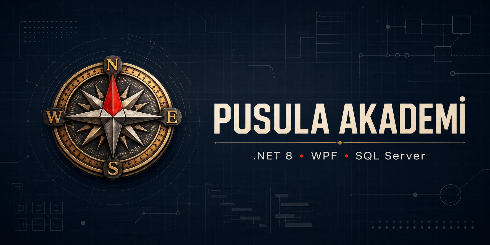

<h1 align="center">Pusula Akademi Yönetim Sistemi</h1>

  <strong>Öğrenci, akademik süreç ve finans operasyonlarını tek merkezde buluşturan Windows masaüstü ERP çözümü.</strong>

  
  
  
  
  

## 30 saniyede proje

| | |
| --- | --- |
| **Problem** | Dershane, kurs ve etüt merkezlerinde öğrenci, ders, sınav ve finans kayıtlarının farklı araçlarda dağınık kalması. |
| **Çözüm** | Günlük kurum operasyonlarını tek Windows uygulamasında birleştiren, rol odaklı ve SQL Server destekli yönetim sistemi. |
| **Benim rolüm** | Ürün kapsamı, WPF/XAML arayüzü, C# iş akışları, SQL Server entegrasyonu ve Windows dağıtım hazırlığı. |
| **Teknolojiler** | .NET 8, C#, WPF, XAML, Microsoft SQL Server ve Microsoft.Data.SqlClient. |

## Ürün kapsamı

- Öğrenci, veli ve kayıt durumu yönetimi
- Sınıf ve ders havuzu oluşturma
- Haftalık ders programı planlama
- Sınav, not ve başarı sıralaması takibi
- Taksit planı, ödeme yöntemi ve gecikme takibi
- Gider, kasa, tahsilat ve dönemsel performans raporları
- Öğretmen, yetkili ve yönetici rollerine göre farklılaşan deneyim
- CSV dışa aktarma, karne görseli oluşturma ve yazdırma
- Yerel ağ üzerinde SQL Server ile çok kullanıcılı çalışma
- Veritabanı yedekleme akışı

## Sistem görünümü

~~~mermaid
flowchart LR
    A[WPF / XAML arayüzü] --> B[C# iş akışları]
    B --> C[Microsoft.Data.SqlClient]
    C --> D[(SQL Server)]
    B --> E[CSV ve PNG çıktıları]
    B --> F[Yazdırma]
    B --> G[Veritabanı yedekleme]
~~~

## Mühendislik yaklaşımı

- **Tek operasyon alanı:** Akademik ve finans süreçleri aynı masaüstü deneyiminde birleşir.
- **Rol odaklı kullanım:** Öğretmen, yetkili ve yönetici işlemleri arayüz seviyesinde ayrıştırılır.
- **Kurum içi çalışma:** Windows cihazları ve yerel ağdaki SQL Server kurulumu hedeflenir.
- **Raporlanabilir veriler:** Tahsilat, gecikme, gider ve başarı kayıtları kullanıcıya dönük çıktılara dönüşür.
- **Parametreli veri erişimi:** Kullanıcı girdisi alan sorgularda güvenli parametre kullanımı esas alınır.

## Gelişim rotası

- WPF ekranlarını MVVM ve servis katmanlarına ayırmak
- Veritabanı işlemlerini asenkron hâle getirmek
- Kimlik doğrulama ve yetkilendirmeyi veri/servis katmanında güçlendirmek
- Ödeme, raporlama ve yetki akışları için otomatik testler eklemek
- CI ile derleme ve test doğrulaması yapmak

© 2026 Pusula Akademi. Tüm hakları saklıdır.
